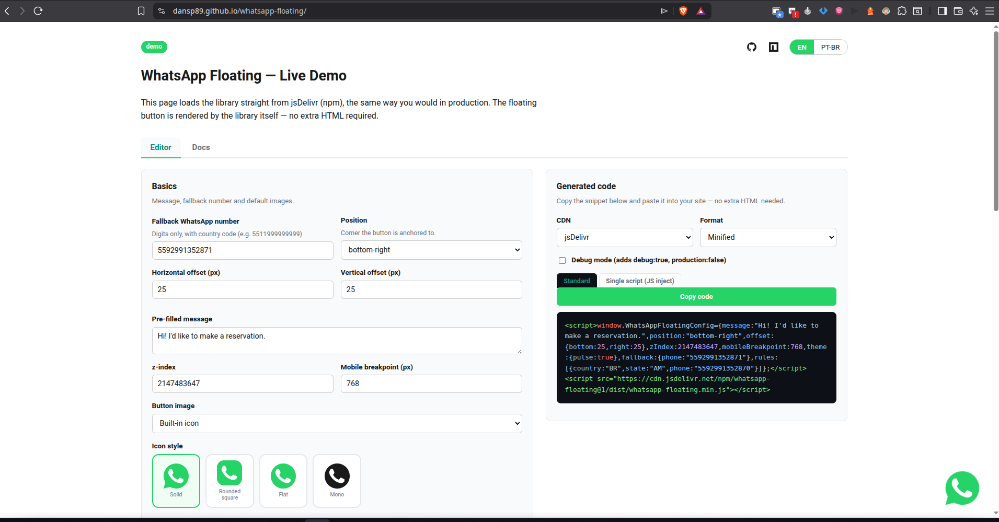

# WhatsApp Floating

[](https://www.npmjs.com/package/whatsapp-floating)
[](https://www.npmjs.com/package/whatsapp-floating)
[](https://bundlephobia.com/package/whatsapp-floating)
[](https://www.jsdelivr.com/package/npm/whatsapp-floating)
[](LICENSE)
[](dist/whatsapp-floating.d.ts)

A dependency-free, TypeScript-built floating WhatsApp contact button. Drop one `<script>` tag on your site and it automatically picks the right phone number for each visitor based on geolocation, business hours, URL path, UTM campaign, language, referrer and more — then renders a floating button, no HTML required.

Built by **[Sellvex](https://sellvex.com.br)**.

**[Live demo](https://dansp89.github.io/whatsapp-floating/)** (English, Português, Español, Italiano, Deutsch, Nederlands, Français, العربية — auto-detected by country, 37 countries in the picker, RTL support for Arabic) — a working page with the floating button, live event log, and every public API method wired to a button.

[](https://dansp89.github.io/whatsapp-floating/)

- **Zero dependencies** — no jQuery, no React, no build step required to use it.
- **Zero global pollution** — only `window.WhatsAppFloatingConfig` (input) and `window.WhatsAppFloating` (API) are created.
- **One HTTP call** for geolocation, resolved in real time by default, with a 5-provider fallback chain so a single flaky API never breaks the widget. Optional `localStorage` caching with automatic IP-change detection (see [Geolocation](#geolocation)).
- **Written in TypeScript**, shipped as a prebuilt bundle: `.min.js` (IIFE for `<script src>`/CDN), `.esm.js`, `.cjs.js` and `.d.ts`.
- Ships with default desktop/mobile PNG icons — override them globally, per rule, per path, or at runtime.

---

## Quick start

```html
<script>
  window.WhatsAppFloatingConfig = {
    message: "Hi! I'd like to make a reservation.",
    fallback: { phone: "5511999999999" }
  };
</script>
<script src="https://cdn.jsdelivr.net/npm/whatsapp-floating/dist/whatsapp-floating.min.js"></script>
```

That's it — no extra HTML markup needed. The button is created and inserted into the DOM automatically, positioned bottom-right by default.

### CDN options

```html
<!-- jsDelivr (npm) -->
<script src="https://cdn.jsdelivr.net/npm/whatsapp-floating@1/dist/whatsapp-floating.min.js"></script>

<!-- unpkg -->
<script src="https://unpkg.com/whatsapp-floating@1/dist/whatsapp-floating.min.js"></script>
```

Pin a version (`@1.0.0`) in production; use `@1` only if you want automatic minor/patch updates.

> `dist/` is not committed to the repository (see [Building from source](#building-from-source)) — it's published to npm instead, which is what the CDN links above resolve against. There is no `cdn.jsdelivr.net/gh/...` variant for this package.

### npm / bundlers

```bash
npm install whatsapp-floating
```

```ts
import WhatsAppFloating from "whatsapp-floating";

WhatsAppFloating.init({
  message: "Hi! I'd like to make a reservation.",
  fallback: { phone: "5511999999999" },
});
```

TypeScript types are bundled (`dist/whatsapp-floating.d.ts`) — no `@types` package needed.

---

## How it works

On load, the library:

1. Reads `window.WhatsAppFloatingConfig`.
2. Resolves the visitor's location (manual override → cache → geolocation API chain).
3. Evaluates `pathRules`, then `rules`, then `fallback` to pick a phone number and, optionally, an image override.
4. Resolves the desktop/mobile image to show.
5. Builds the floating `<a></a>` button and inserts it into `<body>`.
6. Logs the decision to the console (unless `production: true` and `debug` is off).

Only **one HTTP request** is made per page load for geolocation (subject to caching); the fallback chain only issues additional requests if a provider actually fails.

---

## Full configuration reference

All properties are optional except where noted. Everything is set on `window.WhatsAppFloatingConfig` (or passed to `WhatsAppFloating.init(config)`).

### Message & branding

| Property | Type | Default | Description |
|---|---|---|---|
| `message` | `string` | `""` | Pre-filled WhatsApp message, URL-encoded into the `wa.me` link. Supports geolocation placeholders — see [Message placeholders](#message-placeholders). |
| `appendUtmToMessage` | `boolean` | `false` | Appends detected `utm_*` query params to the message text. |
| `ariaLabel` | `string` | `"WhatsApp"` | `aria-label` on the button link. |
| `imageAlt` | `string` | `"WhatsApp"` | `alt` text on the ``. |
| `icon` | `string` (raw SVG markup) | built-in WhatsApp glyph | Custom SVG used instead of an `` when no image URL resolves. See also `iconVariant` (bundled icon set) and `pill` (icon + text button) under [Built-in icon variants](#built-in-icon-variants) and [Pill button](#pill-button-icon--text). |

#### Message placeholders

`message` supports Mustache-style `{{placeholder}}` tokens, replaced with the visitor's resolved geolocation before the `wa.me` link is built. Matching is case-insensitive and tolerates extra spaces (`{{ City }}` works). Unknown placeholders (e.g. `{{foo}}`) are left untouched in the message.

| Placeholder | Replaced with |
|---|---|
| `{{country}}` | Resolved country (code or name, depending on provider — see [Geolocation](#geolocation)). |
| `{{state}}` / `{{region}}` | Resolved state/region (both are aliases for the same value). |
| `{{city}}` | Resolved city. |
| `{{ip}}` | Visitor's public IP address, extracted from the same geolocation provider response (no extra request). |
| `{{ip_base64}}` | Same IP address, base64-encoded (`btoa`). Empty string if the IP isn't available. |

If a value isn't available (a provider didn't return it, or every provider failed), its placeholder is replaced with an empty string rather than left as-is or showing an error.

```js
window.WhatsAppFloatingConfig = {
  fallback: { phone: "5511999999999" },
  message: "Hi! I'm writing from {{city}}, {{state}} ({{country}}).",
};
```

This works the same regardless of which geolocation provider resolved the data — see [Geolocation](#geolocation) for the full built-in provider chain and how fields are normalized across them.

`message` can also use WhatsApp's own plain-text formatting — `*bold*`, `_italic_`, `~strikethrough~`, and `` ```monospace``` `` — which WhatsApp renders natively once the link opens the chat. This isn't processed by the library; it's just WhatsApp's own convention, so you can combine it freely with the placeholders above (e.g. `"Hi, I'm from *{{city}}*"`). The [live demo](https://dansp89.github.io/whatsapp-floating/)'s message editor has toolbar buttons and a live preview for this.

### Images

| Property | Type | Default | Description |
|---|---|---|---|
| `images.desktop` | `string` (URL) | — | Desktop button image. |
| `images.mobile` | `string` (URL) | — | Mobile button image. |
| `assetsBaseUrl` | `string` (URL) | — | When `images` is not set, the library defaults to `${assetsBaseUrl}/whatsapp-desktop.png` and `${assetsBaseUrl}/whatsapp-mobile.png`. Point this at wherever you host the two standard PNGs (e.g. a CDN folder next to the script). |

Resolution order for the final image shown (highest priority first): a runtime `setImages()` call → a matching rule's/path rule's `images` → top-level `images` → the `assetsBaseUrl` defaults.

Images load with `loading="eager"`, `decoding="async"` and `fetchPriority="high"`, and the library injects a `<link rel="preload" as="image">` as soon as the URL is known — the icon is above-the-fold UI, so it is fetched immediately without blocking the main thread.

### Phone routing — location rules

```js
rules: [
  {
    country: "BR",
    state: "AM",
    cities: ["Manaus", "Manacapuru", "Iranduba"],
    phone: "5592999999999"
  },
  { country: "BR", state: "SP", phone: "5511988888888" },
  { country: "US", phone: "12025551234" }
]
```

Matching priority: **City → State → Country → Fallback**. Within each level, rules are scanned top to bottom; the first rule that matches the visitor's location (and any extra conditions below) wins.

| Property | Type | Description |
|---|---|---|
| `country` | `string` | ISO country code/name to match. |
| `state` | `string` | Region/state to match. |
| `city` / `cities` | `string \| string[]` | One or more cities to match (case/accent-insensitive). |
| `phone` | `string` | Fixed number for this rule. |
| `numbers` | `{ phone: string, weight?: number }[]` | Multiple numbers — use with `distribution`. |
| `distribution` | `"random" \| "roundrobin" \| "weighted"` | How to pick among `numbers`. Default `"random"`. (`"round-robin"`/`"round_robin"` are accepted aliases for `"roundrobin"`.) |
| `images` | `{ desktop?, mobile? }` | Overrides the button image when this rule matches. |
| `message` | `string` | Overrides the wa.me `?text=` message when this rule matches — see [Per-rule messages](#per-rule-messages). Falls back to the top-level `message` if omitted. |
| `pillText` | `string` | Overrides the [pill button's](#pill-button-icon--text) label when this rule matches. Only meaningful when the top-level `pill` config is set; resolved the same way as `message` (independently of phone). |
| `schedule` | see [Scheduling](#scheduling) | Rule only matches within business hours/days. |
| `utm` | see [UTM matching](#utm-campaign-matching) | Rule only matches for a given campaign. |
| `language` | `string` | Rule only matches if the browser language starts with this value (e.g. `"en"`). |
| `referrer` | `string` | Rule only matches if `document.referrer` contains this substring. |
| `domain` | `string` | Rule only matches if `location.hostname` contains this substring. |
| `page` | `string` | Rule only matches if the URL path contains this substring. |
| `continent` | `"AF"\|"AS"\|"EU"\|"NA"\|"SA"\|"OC"\|"AN"` | Rule only matches for that continent (derived from the resolved country). |

#### Distribution strategies

When a rule (or `pathRules`/`fallback`) has multiple `numbers` instead of a single `phone`, `distribution` decides which one gets picked each time the widget resolves:

| Strategy | How it picks |
|---|---|
| `"random"` (default) | Picks one number at random out of `numbers`, with equal probability for all of them, every time the widget loads. |
| `"roundrobin"` | Cycles through `numbers` in order (1st, 2nd, 3rd, 1st, 2nd, …), advancing one position each time the widget resolves. **The position counter only lives in memory for the current page session** — it is not persisted to `localStorage` and is not shared across visitors/tabs, so it resets to the start on every full page reload. It's useful for spreading load across multiple resolutions within the same session (e.g. `reload()` calls), not for guaranteeing a strict global rotation across all visitors. Aliases: `"round-robin"`, `"round_robin"` (both behave identically). |
| `"weighted"` | Picks at random, but numbers with a higher `weight` are proportionally more likely to be chosen. `weight` defaults to `1` when omitted, so `{ phone: "A", weight: 2 }, { phone: "B" }` gives "A" a 2-in-3 chance and "B" a 1-in-3 chance. |

```js
numbers: [
  { phone: "5511911111111", weight: 2 }, // picked ~2x as often
  { phone: "5511922222222" }              // weight defaults to 1
],
distribution: "weighted"
```

### Phone & image routing by URL path

`pathRules` are evaluated **before** `rules`, so they can override the phone number and/or images regardless of the visitor's location — useful for landing pages/campaigns (e.g. `/promocao`).

```js
pathRules: [
  {
    path: "/promocao",
    phone: "5511900000000",
    images: {
      desktop: "https://cdn.site.com/promo-desktop.png",
      mobile: "https://cdn.site.com/promo-mobile.png"
    }
  }
]
```

| Property | Type | Description |
|---|---|---|
| `path` | `string` | Substring the current pathname must contain. |
| `pathRegex` | `string` | Regular expression (no slashes) tested against the pathname; use instead of/with `path`. |
| `phone` / `numbers` / `distribution` | same as location rules | If omitted, the phone falls through to location-based `rules`/`fallback`. |
| `images` | `{ desktop?, mobile? }` | Applied even if `phone` is omitted — merges on top of whatever image would otherwise be shown. |
| `message` | `string` | Overrides the wa.me `?text=` message when this path rule matches — see [Per-rule messages](#per-rule-messages). Applied even if `phone` is omitted. |
| `pillText` | `string` | Overrides the pill button's label when this path rule matches — see `rules[].pillText` above. Applied even if `phone` is omitted. |
| `schedule`, `utm` | same as location rules | Extra conditions for the path rule to match. |

### Fallback

```js
fallback: {
  phone: "5511999999999",
  // or:
  numbers: [{ phone: "5511911111111", weight: 2 }, { phone: "5511922222222" }],
  distribution: "weighted",
  message: "Hi! How can we help?" // optional — see Per-rule messages below
}
```

Used when no `pathRules`/`rules` match. Supports the same `numbers`/`distribution`/`message` options as location rules.

### Per-rule messages

Any rule (`rules[]`, `pathRules[]`, or `fallback`) can set its own `message`, overriding the wa.me `?text=` for visitors that rule applies to — e.g. greeting visitors from a specific city differently, or using a campaign-specific message on a landing page matched by `pathRules`. The same rules can also set `pillText` to override just the [pill button's](#pill-button-icon--text) label the same way, when `pill` is configured.

```js
window.WhatsAppFloatingConfig = {
  message: "Hi! I'd like more info.",           // default, used when no rule below applies
  pill: { text: "Talk to us" },                 // default pill label, if using the pill button style
  rules: [
    { country: "BR", state: "SP", message: "Olá! Vi que você é de São Paulo — temos uma oferta especial!", pillText: "Fale com SP" },
    { country: "BR", message: "Olá! Como podemos ajudar?" }
  ],
  pathRules: [
    { path: "/promo", message: "Vim da página de promoção — quero saber mais!", pillText: "Quero a promoção!" }
  ],
  fallback: { phone: "5511999999999" }
};
```

**Resolution for `message` and `pillText` is independent from phone/image resolution** — a rule can set either one without `phone` (and vice versa), so a rule that only overrides the message/pill label still lets phone resolution fall through to another rule/fallback. Priority mirrors phone resolution, evaluated separately for each field: `pathRules` (first match with the field set) → `rules` (City → State → Country, first match at each level with the field set) → `fallback`'s own field → the top-level `message`/`pill.text`. Placeholders (`{{city}}`, `{{state}}`, `{{country}}`, `{{ip}}`, `{{ip_base64}}`) and [WhatsApp's own markdown formatting](#message-placeholders) work the same in a per-rule `message` as in the top-level one (`pillText` is plain text — no markdown/placeholders, same as `pill.text`).

### Scheduling

```js
schedule: {
  days: ["monday", "tuesday", "wednesday", "thursday", "friday"],
  hours: { start: "09:00", end: "18:00" },
  timezone: "America/Manaus" // optional, IANA name; defaults to browser local time
}
```

Attach a `schedule` to any rule (location or path) to restrict it to business hours/days. Overnight ranges (e.g. `22:00`–`06:00`) are supported.

### UTM campaign matching

```js
utm: { source: "google", medium: "cpc" }
```

Matches against `utm_source`, `utm_medium`, etc. query string parameters on the landing URL.

### Manual location override

```js
location: { country: "BR", state: "AM", city: "Manaus" }
```

Skips the geolocation API entirely and uses these values — useful for testing or server-rendered geo hints.

### Geolocation

| Property | Type | Default | Description |
|---|---|---|---|
| `geoApiUrl` | `string` | — | Custom primary geolocation endpoint, tried first. |
| `geoProviders` | `string[]` | — | Additional endpoints appended to the fallback chain. |
| `geoTimeout` | `number` (ms) | `5000` | Per-provider timeout before moving to the next one. |
| `cacheLocation` | `boolean` | `false` | Cache the resolved location in `localStorage`. Off by default so the widget always resolves in real time (e.g. across VPN/network switches). |
| `geoCacheTTL` | `number` (ms) | `21600000` (6h) | Cache lifetime (only applies when `cacheLocation` is `true`); `0` disables expiry. |

Built-in fallback chain (tried in order until one succeeds): **ipapi.co → ipwho.is → ip-api.com → ipinfo.io → ip.oxylabs.io**. `geoApiUrl` (if set) is tried first, `geoProviders` are appended after the built-ins. Note: `ip.oxylabs.io` only exposes `country`/`city` (no `state`/`region`), so it's kept as the last resort.

When `cacheLocation` is `true`, a provider is still queried on every call to read the visitor's current IP (already included in every provider's response, so this costs no extra request). If the IP matches the one stored with the cache, the cached location is reused as-is; if it changed — e.g. the visitor connected through a VPN — the cache is refreshed with the newly resolved location instead of serving stale data.

> `ip-api.com`'s free tier only serves plain HTTP. It's kept as a late fallback so it never blocks HTTPS sites from getting a result via the earlier HTTPS providers, but if you rely on it directly, be aware of mixed-content restrictions.

### Remote configuration

| Property | Type | Description |
|---|---|---|
| `remoteConfigUrl` | `string` | A JSON URL fetched and deep-merged into the local config before initializing — update rules/phones without redeploying the script tag. |

### Layout & positioning

| Property | Type | Default | Description |
|---|---|---|---|
| `position` | `"bottom-right"\|"bottom-left"\|"custom"` | `"bottom-right"` | Corner the button is anchored to. A floating WhatsApp button is conventionally bottom-anchored, so only the two bottom corners are offered as keywords; use `"custom"` to anchor to the top (or any other combination of sides) via `offset` (see below). |
| `offset.top` / `.bottom` / `.left` / `.right` | `number \| string` | `25` (px) | Distance from the anchored corner. Numbers are treated as px; strings accept any CSS length (`"5%"`, `"2rem"`). With `position: "custom"`, every side you set in `offset` is applied as-is — e.g. `{ top: 24, left: "10%" }` anchors to the top-left using independently chosen values instead of being locked to one of the two bottom-corner presets. |
| `mobileBreakpoint` | `number` | `768` | Viewport width (px) at/below which mobile is assumed. |
| `zIndex` | `number` | `2147483647` | Stacking order. |
| `theme.iconSize` | `number \| string` | `64px` | Icon/image height on desktop. Always has a default and is always responsive — see `iconSizeMobile`. |
| `theme.iconSizeMobile` | `number \| string` | `56px` | Icon/image height at/below `mobileBreakpoint`. Defaults independently of `iconSize`, so setting only one still yields a proportionally-adjusted mobile size instead of an unresponsive fixed size. |
| `theme.shadow` | `boolean` | `false` | Adds a drop shadow behind the image. Off by default — the bundled icons never draw their own border/shadow, and most custom images (banners, themed icons) already ship with their own design. |
| `theme.rounded` | `boolean` | `false` | Rounds the image's corners. Off by default for the same reason. |
| `theme.dark` | `boolean` | `false` | When combined with `theme.shadow`, uses a heavier shadow suited for dark backgrounds. |
| `css` | `string` | — | Raw CSS appended after the library's own styles, for custom tweaks. |

Mobile is detected when `window.innerWidth <= mobileBreakpoint` **or** the URL path contains `/mobile`. The button image never exceeds `90vw` in either dimension and keeps its natural aspect ratio — no cropping, no forced circle/square.

### Pulse animation

```js
theme: { pulse: true }
// or, fully configured:
theme: {
  pulse: {
    scale: true,       // icon "breathing" scale animation
    ring: true,         // expanding colored ring/halo
    duration: 1800,      // ms per cycle
    scaleAmount: 1.08,   // peak scale factor for the breathing effect
    color: "#25D366",    // ring color
    opacity: 0.55         // ring starting opacity
  }
}
```

| Property | Type | Default | Description |
|---|---|---|---|
| `theme.pulse` | `boolean \| PulseConfig` | `false` | `true` enables the icon scale/"breathing" animation with default timing — equivalent to `{ scale: true }`. Pass an object to also enable the ring/halo effect or tune timing/appearance. |
| `pulse.scale` | `boolean` | `true` when `pulse` is set at all | Icon scale ("breathing") animation. |
| `pulse.ring` | `boolean` | `false` | Expanding colored ring/halo around the button, independent of `scale` — enable either, both, or neither. |
| `pulse.duration` | `number` (ms) | `1800` | Animation cycle length, shared by both effects. |
| `pulse.scaleAmount` | `number` | `1.08` | Peak scale factor for the breathing effect. |
| `pulse.color` | `string` | `"#25D366"` | Ring color. |
| `pulse.opacity` | `number` | `0.55` | Ring starting opacity (fades to `0` as it expands). |

### Built-in icon variants

No image hosting required — pick a bundled, dependency-free SVG icon by name. None of them draw a border, outline or shadow of their own (that stays fully opt-in via `theme.shadow`/`theme.rounded` above).

```js
iconVariant: "roundedSquare"
```

| Key | Description |
|---|---|
| `"solid"` | The library's default circular WhatsApp glyph (used automatically if you set nothing at all). |
| `"roundedSquare"` | Same glyph on a rounded-square background. |
| `"flat"` | Larger circular glyph, flush edge-to-edge. |
| `"mono"` | Circular glyph on a dark/neutral background instead of WhatsApp green. |

`iconVariant` is ignored when `images`/`assetsBaseUrl` resolve to an actual image URL (images always win), and when `pill` is set (see below). An explicit `icon` (raw custom SVG string) still wins over `iconVariant`.

### Pill button (icon + text)

Renders an icon-and-text pill instead of an image/icon — no image hosting needed, matches your own call-to-action copy. Picking `pill` is an **exclusive** button style: when set, `images`, `assetsBaseUrl`, `icon` and `iconVariant` are all ignored entirely.

```js
pill: {
  text: "Fale conosco",
  expand: "hover",     // "hover" | "always" | "click" | "never"
  icon: "solid"          // any built-in icon variant key, defaults to "solid"
}
```

| Property | Type | Default | Description |
|---|---|---|---|
| `pill.text` | `string` | — (required) | The label shown next to the icon. Any rule/pathRule/fallback can override just this label per-visitor via its own `pillText` — see [Per-rule messages](#per-rule-messages), same resolution logic. |
| `pill.expand` | `"hover"\|"always"\|"click"\|"never"` | `"hover"` | `"hover"` expands on mouse hover, collapsing back to icon-only otherwise (desktop-friendly). `"always"` stays expanded. `"click"` — the first click/tap only reveals the label (no navigation, no `open` event); the next click opens WhatsApp normally. `"never"` stays icon-only forever; the text is still set as the accessible label. |
| `pill.icon` | icon variant key or custom SVG string | `"solid"` | Icon shown inside the pill — same choices as `iconVariant` above. |
| `pill.color` | `string` (CSS color) | `"#25D366"` | Pill background color. |
| `pill.textColor` | `string` (CSS color) | `"#ffffff"` | Pill label text color. |
| `pill.fontSize` | `number` (px) | `14` | Font size of the label in pixels. |
| `pill.fontWeight` | `number\|string` | `600` | CSS font-weight of the label (e.g. `400`, `700`). |
| `pill.paddingRight` | `number` (px) | `18` | Extra horizontal padding between the label and the right edge of the pill. |
| `pill.borderRadius` | `number` (px) | `999` | Border radius of the pill. Use `0` for a square button, `4`–`16` for rounded-rectangle, `999` for fully-rounded. |

`ariaLabel` still wins if explicitly set; otherwise the pill's `aria-label` defaults to `pill.text` (more descriptive than the generic "WhatsApp" fallback used elsewhere).

### Analytics

| Property | Type | Default | Description |
|---|---|---|---|
| `analytics` | `boolean` | `true` | Master switch for the integrations below. |

When enabled, `render` and `open` events are automatically pushed to:
- **Google Analytics (gtag.js)** — `gtag("event", ...)`
- **Google Tag Manager** — `window.dataLayer.push(...)`
- **Meta Pixel** — `fbq("trackCustom", ...)`

No extra configuration needed — the library detects `window.gtag`, `window.dataLayer` and `window.fbq` if present.

### Debug / production

| Property | Type | Default | Description |
|---|---|---|---|
| `debug` | `boolean` | `false` | Verbose console logging for every internal step. |
| `production` | `boolean` | `true` | When `true` and `debug` is `false`, suppresses the console summary block. |
| `lazyLoad` | `boolean` | `false` | Defer initialization until the `load` event instead of running immediately. |

### Events

| Property | Payload | Fired when |
|---|---|---|
| `onReady` | `{ phone, location, matched }` | The button has been rendered and is ready. |
| `onLocation` | `{ country, state, city, ip }` | Geolocation has resolved. |
| `onPhoneSelected` | `{ phone, matched }` | A phone number has been chosen. |
| `onOpen` | `{ phone }` | The button was clicked (or `.open()` called). |
| `onClose` | `{ phone }` | `.close()` was called. |

`matched` is one of `"Path" | "Cidade" | "Estado" | "País" | "Fallback" | "Manual"`, describing which rule tier decided the number.

Every event is also dispatched as a `document`-level `CustomEvent` named `whatsappfloating:<event>` (e.g. `whatsappfloating:ready`), for listening from unrelated scripts without touching the config object.

### Console output

Unless suppressed by `production`/`debug`, every resolution prints a summary:

```
Country: BR
State: AM
City: Manaus
Matched: Cidade
Phone: 5592999999999
```

---

## Public API

Available on `window.WhatsAppFloating` (global build) or as the default export (npm build).

```ts
WhatsAppFloating.init(config);          // (re)initialize with a full config
WhatsAppFloating.reload(partialConfig?); // re-run resolution, optionally merging new config
WhatsAppFloating.open();                // open the wa.me link programmatically
WhatsAppFloating.close();               // hide the button
WhatsAppFloating.destroy();             // remove the button from the DOM
WhatsAppFloating.getPhone();            // -> string | null
WhatsAppFloating.getLocation();         // -> { country, state, city, ip }
WhatsAppFloating.getMatched();          // -> "Path" | "Cidade" | "Estado" | "País" | "Fallback" | "Manual" | null
WhatsAppFloating.setPhone(phone);       // override the phone number at runtime
WhatsAppFloating.setImages(images);     // override desktop/mobile images at runtime — highest priority
WhatsAppFloating.getImages();           // -> the currently resolved { desktop, mobile }
WhatsAppFloating.isReady();             // -> boolean
WhatsAppFloating.on(event, fn);         // subscribe to an event without touching config
WhatsAppFloating.off(event, fn);        // unsubscribe
```

---

## Default assets

The library does not bundle icon binaries into the JS payload — instead it references two PNGs by convention:

```
whatsapp-desktop.png
whatsapp-mobile.png
```

Host these two files anywhere (your own CDN, the same folder as the script, etc.) and point `assetsBaseUrl` at that folder; the library builds the final URLs itself. You can always override them — globally via `images`, per rule/path via each rule's `images`, or at runtime via `setImages()`.

---

## Project structure

```
src/            TypeScript source (types, geo, rules, schedule, styles, analytics, widget, index)
dist/           Prebuilt output — this is what you deploy to a CDN
  whatsapp-floating.min.js     IIFE, minified — use this in <script src="...">
  whatsapp-floating.global.js  IIFE, unminified — for debugging
  whatsapp-floating.esm.js     ES module — for bundlers
  whatsapp-floating.cjs.js     CommonJS — for Node/older bundlers
  whatsapp-floating.d.ts       TypeScript type definitions
docs/           Standalone demo page (docs/index.html) + sample assets — also
                served as the public GitHub Pages site (github.com settings:
                Pages → Deploy from a branch → main → /docs)
  locales/      Demo page translations, one JSON file per language (en.json
                is the required fallback). Source of truth for the demo's
                i18n — edit these, not the inline object in index.html.
scripts/        One-off maintenance scripts (currently just the demo's
                i18n build step, see below) — not part of the published package.
```

Only `dist/` (plus `README.md`/`LICENSE`) is published to npm — the package is meant to be consumed as a build artifact, not compiled by consumers.

## Building from source

```bash
npm install
npm run build      # outputs to dist/
npm run typecheck  # tsc --noEmit
npm run dev         # watch mode
```

### Demo page translations

The demo's country picker (37 countries, auto-detected via geolocation, defaulting to the United States/English until detection resolves or a saved choice is restored) maps each country to a language; the corresponding text lives in `docs/locales/*.json`. `en.json` is the only one required — any language missing a translation, or any key missing from a translation, falls back to English automatically.

Currently translated: `en`, `pt` (Brazil, Portugal), `es` (Mexico, Argentina, Colombia, Peru, Chile, Paraguay, Uruguay, Bolivia, Ecuador, Venezuela, Spain), `it` (Italy), `de` (Germany, Austria, Switzerland), `nl` (Netherlands, Belgium), `fr` (France), `ar` (UAE, Saudi Arabia, Qatar, Kuwait, Oman, Bahrain — rendered right-to-left, see below). Countries where English is already a common working language (India, South Africa, Nigeria, Kenya, Ghana, Indonesia, Malaysia, Singapore, Pakistan, Bangladesh) use `en` directly rather than a machine-translated local language.

`ar`'s `htmlLang` triggers `dir="rtl"` on `<html>` (see `RTL_LANGS` in `docs/index.html`) — the whole layout mirrors automatically via CSS `flex`/`grid` direction, with a few explicit `html[dir="rtl"]` overrides for the country-select icon and table alignment. Code snippets and placeholders (`{{city}}`, config property names, etc.) stay left-to-right inside the RTL flow, since they're identifiers, not prose.

After editing a file under `docs/locales/`, regenerate the inline dictionary embedded in `docs/index.html`:

```bash
npm run docs:i18n
```

This is a build step, not a runtime fetch — `docs/index.html` is opened both via GitHub Pages (https://) and directly from disk (`file://`), and `fetch()` of local JSON is blocked by CORS in the latter case. The script (`scripts/build-docs-i18n.js`) reads every `docs/locales/*.json` and inlines them between the `I18N_INJECT_START`/`I18N_INJECT_END` markers in `docs/index.html` — commit the regenerated `index.html` alongside your locale change.

To add a new language: create `docs/locales/<lang>.json` (copy `en.json` as a starting point and translate its values, not its keys), run `npm run docs:i18n`, then add a `{ code, name, lang }` entry to the `COUNTRIES` array in `docs/index.html` for any country that should use it.

## Browser support

Chrome, Firefox, Safari, Edge, Opera, Android, iOS — any browser supporting `fetch`, `Promise` and `CustomEvent` (all evergreen browsers).

## License

MIT © [Sellvex](https://sellvex.com.br)
